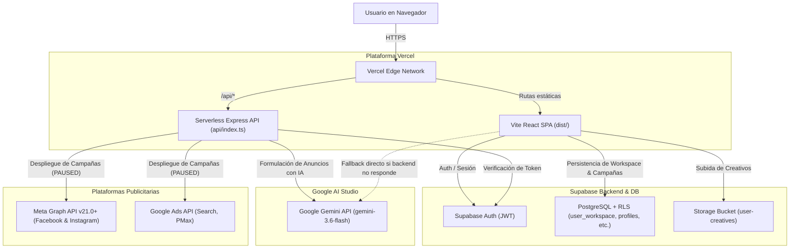

# Stack Tecnológico y Arquitectura — Tico TicTac Agency

Documento de referencia permanente para la arquitectura, infraestructura, base de datos y despliegue de **Tico - TicTac Agency Performance**.

---

## 1. Resumen del Stack Tecnológico

| Capa | Tecnología / Plataforma | Función Principal |
| :--- | :--- | :--- |
| **Despliegue / Hosting** | **Vercel** | Hosting del frontend Vite React SPA y ejecución de Serverless Functions (`/api/*`) |
| **Control de Versiones** | **GitHub** (`dsancalderon/Tico-TicTacAgency`) | Repositorio central de código, control de versiones y CI/CD automático con Vercel |
| **Backend & Base de Datos** | **Supabase** | PostgreSQL con RLS, Autenticación (JWT), Storage (`user-creatives`), Vault |
| **Motor de Inteligencia Artificial** | **Google Gemini (Google AI Studio)** | Formulación de estrategias, redacción de copys persuasivos (AIDA/PAS) y segmentaciones |
| **APIs Publicitarias** | **Meta Graph API (v21.0+)** & **Google Ads API** | Diagnóstico de cuentas, lectura de métricas y despliegue de campañas en estado `PAUSED` |

---

## 2. Flujo de Arquitectura y Despliegue

---

## 3. Configuración de Variables de Entorno en Vercel

Para que la aplicación formule anuncios y estrategias con IA real en Vercel (sin caer en errores o textos predeterminados), se deben configurar las siguientes variables en **Vercel Dashboard > Settings > Environment Variables**:

### Variables del Servidor (Serverless Functions)
- `GEMINI_API_KEY`: Clave de API de Google AI Studio. **Indispensable** para que el backend llame a `gemini-3.6-flash` y registre las peticiones en tu cuenta de Google AI Studio.
- `SUPABASE_URL`: URL del proyecto de Supabase (ej. `https://xxxx.supabase.co`).
- `SUPABASE_PUBLISHABLE_KEY`: Clave pública `anon` de Supabase.
- `ENABLE_ADVERTISING_API`: `true` (habilita la creación de campañas en Meta/Google).
- `PORT`: `4000` (utilizado para entorno local).

### Variables del Cliente (Vite Frontend)
- `VITE_SUPABASE_URL`: URL de Supabase para el cliente web.
- `VITE_SUPABASE_PUBLISHABLE_KEY`: Clave pública `anon` para el cliente web.
- `VITE_API_BASE_URL`: `/api` (ruta relativa para Vercel).

---

## 4. Seguridad y Gestión de la Clave de Google Gemini
Siguiendo las mejores prácticas de seguridad web:
1. **Aislamiento 100% en el Servidor (Backend)**: La clave `GEMINI_API_KEY` reside única y exclusivamente en las Variables de Entorno de **Vercel** (`process.env.GEMINI_API_KEY`). Nunca se expone en el código cliente, ni en respuestas JSON, ni en el almacenamiento local (`localStorage`) del navegador.
2. **Canal Seguro**: Todas las solicitudes de redacción de copys y segmentación pasan por la función serverless de Vercel (`/api/campaigns/generate-meta-builder`), autenticadas mediante el token de sesión del usuario en Supabase.
3. **Pestaña Conexiones Limpia**: El apartado de Conexiones se mantiene enfocado exclusivamente en las plataformas oficiales de pauta publicitaria (**Meta Ads** y **Google Ads**).

