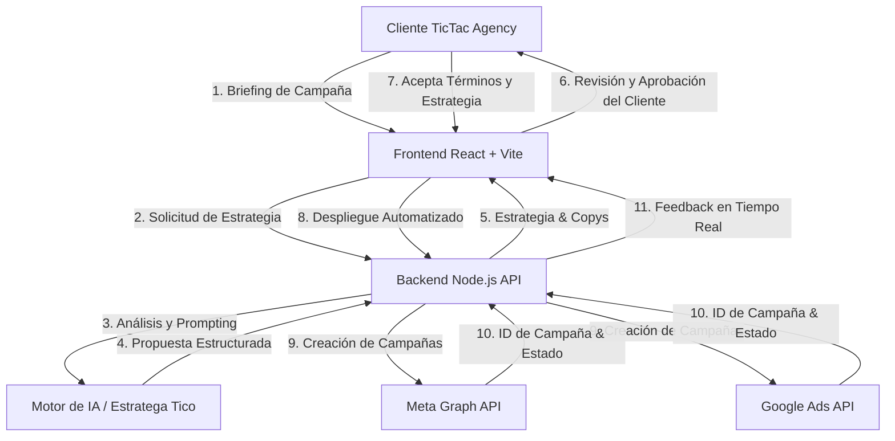

# Arquitectura de Tico - TicTac Agency Performance

## 1. Visión General del Sistema
**Tico** es el agente automatizado de pauta digital de **TicTac Agency Performance**, diseñado para agilizar y optimizar la creación, validación y publicación directa de campañas publicitarias en **Meta Ads** y **Google Ads**.

---

## 2. Componentes Principales

### A. Capa Frontend (Client)
- **Tecnologías**: React 19, TypeScript, Tailwind CSS v4, Vite.
- **Módulos clave**:
  - **Briefing Wizard**: Formulario modular para recopilación de contexto de marca, presupuesto, duración, objetivos y segmentación básica.
  - **Strategy Visualizer**: Dashboard interactivo que desglosa el presupuesto entre canales (ej. 60% Meta / 40% Google), muestra copys sugeridos, audiencias y palabras clave.
  - **Approval Gate**: Bloque de validación donde el cliente confirma explícitamente el presupuesto y la estrategia antes de incurrir en gasto de pauta.
  - **Deployment Monitor**: Consola visual con logs en vivo que muestra el progreso de llamada a las APIs publicitarias y los IDs asignados.

### B. Capa Backend (Node.js API)
- **Tecnologías**: Node.js, Express, TypeScript, Axios.
- **Servicios Core**:
  - `aiStrategist.ts`: Transforma el briefing del cliente en una estrategia publicitaria balanceada (presupuesto, formatos de anuncio, segmentación demográfica y psicográfica, palabras clave en concordancia exacta/frase).
  - `metaAdsService.ts`: Interactúa con Meta Graph API (v21.0+) para crear Campañas, Conjuntos de Anuncios (Ad Sets) y Creatividades (Ad Creatives).
  - `googleAdsService.ts`: Interactúa con Google Ads REST/gRPC API para configurar Campañas de Búsqueda / Performance Max, grupos de anuncios, extensiones y presupuestos compartidos.
  - `policyValidator.ts`: Verifica que los anuncios cumplan con las directrices de contenido y privacidad antes del envío.

---

## 3. Seguridad y Privacidad de Datos
1. **Credenciales en Servidor**: Las claves de API, tokens de usuario del sistema (Meta) y OAuth2 Refresh Tokens (Google Ads) nunca se exponen al navegador cliente.
2. **Aprobación Obligatoria**: Ningún anuncio ni presupuesto es enviado a las APIs de pauta sin la confirmación explícita del cliente.
3. **Manejo de Presupuestos**: Límites de gasto diarios estrictos aplicados a nivel de campaña para prevenir sobrefacturación.
